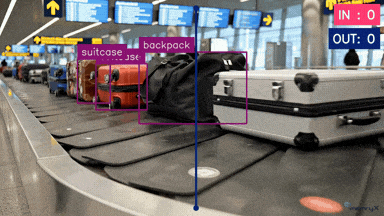
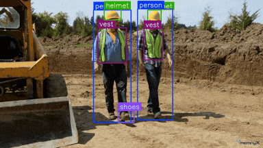

<!-- Define the reusable badges -->
[python-badge]: https://img.shields.io/badge/Python-green "Python"
[cpp-badge]: https://img.shields.io/badge/C++-blue "C++"

<picture>
  <source srcset="assets/mx_examples.png" media="(prefers-color-scheme: dark)">
  <source srcset="assets/mx_examples_light.png" media="(prefers-color-scheme: light)">
  
</picture>


[](https://developer.memryx.com)
[](https://www.python.org)
[](https://en.cppreference.com)
[](https://onnx.ai)
[](https://keras.io)
[](https://www.tensorflow.org)
[](https://www.tensorflow.org/lite)


# MemryX eXamples

Welcome to **MemryX eXamples**, a collection of end-to-end AI applications and tasks powered by MemryX hardware and software solutions. Whether you're performing real-time video inference, exploring fun AI projects, or generating text, these examples provide practical, hands-on use cases to help you fully leverage MemryX technology. For detailed guides and tutorials, visit the [MemryX Developer Hub](https://developer.memryx.com/index.html).

## Before You Start

To ensure a smooth experience with MemryX solutions, follow these steps before diving into the examples:

- **Explore the [Developer Hub](https://developer.memryx.com/index.html):** Your gateway to comprehensive documentation for MemryX hardware and software.
- **Install the [MemryX SDK](https://developer.memryx.com/get_started/install.html):** Set up the essential tools and drivers to begin using MemryX accelerators.
- **Check out our [Tutorials](https://developer.memryx.com/tutorials/tutorials.html):** Step-by-step instructions for various use cases and end-to-end applications.
- **Explore the [Model Explorer](https://developer.memryx.com/model_explorer/models.html):** A great starting point for discovering models compiled and tested on MemryX accelerators.

## Get Started

> [!IMPORTANT]
> **MemryX SDK 2.1** is now released!
> Please update to the [latest SDK version](https://developer.memryx.com/get_started/index.html) **before** proceeding with any of the examples.


### Step 1: Prepare Your System and Install the MemryX SDK

Before working with the examples, ensure your system is correctly set up by installing the MemryX SDK.
Follow the detailed instructions here: [**MemryX SDK Get Started Guide**](https://developer.memryx.com/get_started/index.html).

### Step 2: Clone the MemryX eXamples Repository

Clone this repository plus any linked submodules with:

```bash
git clone --recursive https://github.com/memryx/memryx_examples.git
```

## Example Categories

> [!NOTE]
> Applications marked with **📝** have tutorials available. Clicking on the icon will take you directly to the tutorial page.

<details>
<summary><b>Jump to a category</b></summary>

- [Real-Time Video Inference 🎥](#real-time-video-inference)
- [Open-Vocabulary 📖](#open-vocabulary)
- [Image Inference 🖼️](#image-inference)
- [Multi-Stream Applications 🖥️](#multi-stream-applications)
- [Multi-DFP Applications 🔀](#multi-dfp-applications)
- [Fun Projects 🤖](#fun-projects)
- [Audio Inference 🔊](#audio-inference)
- [Accuracy Calculation ✅](#accuracy-calculation)

</details>

<a id="real-time-video-inference"></a>
### Real-Time Video Inference 🎥
Leverage MemryX accelerators for **real-time video processing** tasks. These applications demonstrate how to run models efficiently on live video streams.


<table>
  <tr>
    <td align="center" valign="top" width="25%">
      <a href="video_inference/singlestream_objectdetection_yolov7Tiny/README.md"><b>YOLOv7</b></a>
      <a href="https://developer.memryx.com/tutorials/realtime_inf/realtime_od.html">📝</a><br/>
      <a href="video_inference/singlestream_objectdetection_yolov7Tiny/README.md">
        
      </a><br/>
      <sub>COCO object detection</sub><br/>
      <sub>Model: YOLOv7 (Tiny)</sub><br/>
      
      
    </td>
    <!-- new cell -->
    <td align="center" valign="top" width="25%">
      <a href="video_inference/centernet/README.md"><b>CenterNet</b></a>
      <a href="https://developer.memryx.com/tutorials/realtime_inf/autocrop_inf/autocrop_centernet.html">📝</a><br/>
      <a href="video_inference/centernet/README.md">
        
      </a><br/>
      <sub>COCO object detection</sub><br/>
      <sub>Model: CenterNet</sub><br/>
      
      
    </td>
    <!-- new cell -->
    <td align="center" valign="top" width="25%">
      <a href="video_inference/object_detection_yolox/README.md"><b>YoloX</b></a><br/>
      <a href="video_inference/object_detection_yolox/README.md">
        
      </a><br/>
      <sub>COCO object detection</sub><br/>
      <sub>Model: YoloX (Medium)</sub><br/>
      
      
    </td>
    <!-- new cell -->
    <td align="center" valign="top" width="25%">
      <a href="video_inference/vehicle_detection/README.md"><b>Vehicle Detection</b></a><br/>
      <a href="video_inference/vehicle_detection/README.md">
        
      </a><br/>
      <sub>Vehicle detection</sub><br/>
      <sub>Model: Vehicle-Detection-0200</sub><br/>
      
      
    </td>
  </tr>
  <!-- new row -->
  <tr>
    <td align="center" valign="top" width="25%">
      <a href="video_inference/segmentation_yolov8/README.md"><b>YOLOv8 Segmentation</b></a><br/>
      <a href="video_inference/segmentation_yolov8/README.md">
        
      </a><br/>
      <sub>Instance segmentation</sub><br/>
      <sub>Model: YOLOv8 Nano Segmentation</sub><br/>
      
      
      
    </td>
    <!-- new cell -->
    <td align="center" valign="top" width="25%">
      <a href="video_inference/pose_estimation_yolov8/README.md"><b>YOLOv8 Pose</b></a>
      <a href="https://developer.memryx.com/tutorials/realtime_inf/realtime_pose.html">📝</a><br/>
      <a href="video_inference/pose_estimation_yolov8/README.md">
        
      </a><br/>
      <sub>Human pose estimation</sub><br/>
      <sub>Model: YOLOv8 (Medium)</sub><br/>
      
      
      
      
    </td>
    <!-- new cell -->
    <td align="center" valign="top" width="25%">
      <a href="video_inference/depth_midas/README.md"><b>MiDaS Depth</b></a>
      <a href="https://developer.memryx.com/tutorials/realtime_inf/realtime_depth.html">📝</a><br/>
      <a href="video_inference/depth_midas/README.md">
        
      </a><br/>
      <sub>Monocular depth estimation</sub><br/>
      <sub>Model: MiDaS</sub><br/>
      
      
      
      
    </td>
    <!-- new cell -->
    <td align="center" valign="top" width="25%">
      <a href="video_inference/pointcloud_from_depth/README.md"><b>Depth to 3D</b></a><br/>
      <a href="video_inference/pointcloud_from_depth/README.md">
        
      </a><br/>
      <sub>Point cloud from depth</sub><br/>
      <sub>Model: MiDaS</sub><br/>
      
      
      
    </td>
  </tr>
  <!-- new row -->
  <tr>
    <td align="center" valign="top" width="25%">
      <a href="video_inference/face_emotion_detection/README.md"><b>Face + Emotion</b></a>
      <a href="https://developer.memryx.com/tutorials/realtime_inf/realtime_multimodel.html">📝</a><br/>
      <a href="video_inference/face_emotion_detection/README.md">
        
      </a><br/>
      <sub>Face + emotion classification</sub><br/>
      <sub>Multiple Models</sub><br/>
      
      
      
    </td>
    <!-- new cell -->
    <td align="center" valign="top" width="25%">
      <a href="video_inference/realtime_facelandmark_detection/README.md"><b>Face Landmarks</b></a><br/>
      <a href="video_inference/realtime_facelandmark_detection/README.md">
        
      </a><br/>
      <sub>Facial landmark tracking</sub><br/>
      <sub>Model: BlazeFace & FaceMesh</sub><br/>
      
      
    </td>
    <!-- new cell -->
    <td align="center" valign="top" width="25%">
      <a href="video_inference/mediapipe_hands/README.md"><b>Mediapipe Hands</b></a><br/>
      <a href="video_inference/mediapipe_hands/README.md">
        
      </a><br/>
      <sub>Hand landmark tracking</sub><br/>
      <sub>Models: PalmDet &amp; HandPose</sub><br/>
      
      
      
    </td>
    <!-- new cell -->
    <td align="center" valign="top" width="25%">
      <a href="video_inference/wireframe/README.md"><b>Wireframe</b></a><br/>
      <a href="video_inference/wireframe/README.md">
        
      </a><br/>
      <sub>Line / wireframe detection</sub><br/>
      <sub>Model: M-LSD (Large)</sub><br/>
      
      
    </td>
  </tr>
  <!-- new row -->
  <tr>
    <td align="center" valign="top" width="25%">
      <a href="video_inference/traffic_analysis/README.md"><b>Traffic Analysis</b></a><br/>
      <a href="video_inference/traffic_analysis/README.md">
        
      </a><br/>
      <sub>Oriented bounding boxes detection</sub><br/>
      <sub>Model: YOLOv8s-OBB</sub><br/>
      
      
    </td>
    <!-- new cell -->
    <td align="center" valign="top" width="25%">
      <a href="video_inference/football_cv/README.md"><b>FootballCV</b></a><br/>
      <a href="video_inference/football_cv/README.md">
        
      </a><br/>
      <sub>Football Video Analysis</sub><br/>
      <sub>Models: Yolov8 (small)</sub><br/>
      
      
      
    </td>
    <!-- new cell -->
    <td align="center" valign="top" width="25%">
      <a href="video_inference/luggage_counting_yolov8/README.md"><b>Luggage counting</b></a><br/>
      <a href="video_inference/luggage_counting_yolov8/README.md">
        
      </a><br/>
      <sub>COCO object detection</sub><br/>
      <sub>Model: YOLOv8 (Nano)</sub><br/>
      
      
    </td>
    <!-- new cell -->
    <td align="center" valign="top" width="25%">
      <a href="video_inference/ppe_detection_tracking_yolov8/README.md"><b>PPE Detection</b></a><br/>
      <a href="video_inference/ppe_detection_tracking_yolov8/README.md">
        
      </a><br/>
      <sub>Personal protective equipment detection</sub><br/>
      <sub>Model: YOLOv8 (Nano)</sub><br/>
      
      
    </td>
  </tr>
  <!-- new row -->
  <tr>
    <td align="center" valign="top" width="25%">
      <a href="video_inference/object_blurring_yolov8/README.md"><b>Object Blurring</b></a><br/>
      <a href="video_inference/object_blurring_yolov8/README.md">
        
      </a><br/>
      <sub>Blur detected persons with YOLOv8</sub><br/>
      <sub>Model: YOLOv8 (Small)</sub><br/>
      
      
    </td>
    <!-- new cell -->
    <td align="center" valign="top" width="25%">
      <a href="video_inference/object_tracking_yolov8/README.md"><b>Object Tracking</b></a><br/>
      <a href="video_inference/object_tracking_yolov8/README.md">
        
      </a><br/>
      <sub>Number and track objects with YOLOv8 and SuperVision tracking</sub><br/>
      <sub>Model: YOLOv8 (Small)</sub><br/>
      
      
    </td>
    <!-- new cell -->
    <td align="center" valign="top" width="25%">
      <a href="video_inference/realtime_multiface_recognition/README.md"><b>Multi-Face ID</b></a><br/>
      <a href="video_inference/realtime_multiface_recognition/README.md">
        
      </a><br/>
      <sub>Interactive multi-face recognition</sub><br/>
      <sub>Multiple Models</sub><br/>
      
      
    </td>
    <!-- new cell -->
    <td align="center" valign="top" width="25%">
      <a href="video_inference/singlestream_peopletracking_yolov7Tiny/README.md"><b>Person Tracking</b></a><br/>
      <a href="video_inference/singlestream_peopletracking_yolov7Tiny/README.md">
        
      </a><br/>
      <sub>Person tracking + IDs</sub><br/>
      <sub>Model: YOLOv7 (Tiny)</sub><br/>
      
      
    </td>
  </tr>
  <!-- new row -->
  <tr>
    <td align="center" valign="top" width="25%">
      <a href="video_inference/intrusion_detection/README.md"><b>Intrusion Detection</b></a><br/>
      <a href="video_inference/intrusion_detection/README.md">
        
      </a><br/>
      <sub>ROI intrusion alerts</sub><br/>
      <sub>Models: Yolov8 &amp; ByteTrack</sub><br/>
      
      
    </td>
    <!-- new cell -->
    <td align="center" valign="top" width="25%">
      <a href="video_inference/rtmpose_estimate/README.md"><b>Rtmpose Estimate</b></a><br/>
      <a href="video_inference/rtmpose_estimate/README.md">
        
      </a><br/>
      <sub>Pose Estimate with tracking</sub><br/>
      <sub>Models: Yolox &amp; Rtmpose</sub><br/>
      
      
    </td>
    <!-- new cell -->
    <td align="center" valign="top" width="25%">
      <a href="video_inference/fire_detection_yolov8/README.md"><b>Fire Detection</b></a><br/>
      <a href="video_inference/fire_detection_yolov8/README.md">
        
      </a><br/>
      <sub>Fire detection with tracking</sub><br/>
      <sub>Models: Yolov8</sub><br/>
      
      
    </td>
    <!-- new cell -->
    <td align="center" valign="top" width="25%">&nbsp;</td>
  </tr>
</table>


<a id="open-vocabulary"></a>
### Open-Vocabulary 📖
Explore how the MemryX accelerators can be used for open-vocabulary tasks. The examples below demonstrate how to run models using MemryX hardware.

<table>
  <tr>
    <td align="center" valign="top" width="45%">
      <a href="open_vocabulary/yoloe/README.md"><b>YoloE Open-Vocab Seg</b></a><br/>
      <a href="open_vocabulary/yoloe/README.md">
        
      </a><br/>
      <sub>Open-vocabulary detection + segmentation</sub><br/>
      <sub>Model: yoloe-v8s-seg</sub><br/>
      
      
    </td>
    <!-- new cell -->
    <td align="center" valign="top" width="35%">
      <a href="open_vocabulary/clipResNet50/README.md"><b>CLIP Zero-Shot Classify</b></a><br/>
      <a href="open_vocabulary/clipResNet50/README.md">
        
      </a><br/>
      <sub>Zero-shot object classification</sub><br/>
      <sub>Model: ClipResNet50</sub><br/>
      
      
    </td>
  </tr>
</table>

<a id="image-inference"></a>
### Image Inference 🖼️
Explore models performing inference on static images and data. These examples demonstrate how to leverage the MXA to process large amounts of data.

<table>
  <tr>
    <td align="center" valign="top" width="35%">
      <a href="image_inference/oriented_bounding_boxes/README.md"><b>Oriented Boxes (Satellite)</b></a><br/>
      <a href="image_inference/oriented_bounding_boxes/README.md">
        
      </a><br/>
      <sub>Oriented bounding boxes on satellite imagery</sub><br/>
      <sub>Model: YoloV8m-OBB</sub><br/>
      
      
    </td>
    <!-- new cell -->
    <td align="center" valign="top" width="35%">
      <a href="image_inference/face_recognition/README.md"><b>Face Detection + Recognition</b></a><br/>
      <a href="image_inference/face_recognition/README.md">
        
      </a><br/>
      <sub>Face detection + recognition on images</sub><br/>
      <sub>Models: YoloV8n-Face &amp; FaceNet</sub><br/>
      
      
    </td>
  </tr>
</table>


<a id="multi-stream-applications"></a>
### Multi-Stream Applications 🖥️

Maximize performance by running multiple video streams concurrently on MemryX accelerators.

<table>
  <tr>
    <td align="center" valign="top" width="33%">
      <a href="multistream_video_inference/object_detection_yolov8/README.md"><b>Multi-Stream YOLOv8</b></a>
      <a href="https://developer.memryx.com/tutorials/multistream_realtime_inf/multistream_od_yolov8s.html">📝</a><br/>
      <a href="multistream_video_inference/object_detection_yolov8/README.md">
        
      </a><br/>
      <sub>Detect objects across multiple streams</sub><br/>
      <sub>Model: YOLOv8 (Small)</sub><br/>
      
      
      
    </td>
    <!-- new cell -->
    <td align="center" valign="top" width="33%">
      <a href="multistream_video_inference/multistream_objectdetection_yolov7Tiny/README.md"><b>Multi-Stream YOLOv7</b></a>
      <a href="https://developer.memryx.com/tutorials/multistream_realtime_inf/multistream_od.html">📝</a><br/>
      <a href="multistream_video_inference/multistream_objectdetection_yolov7Tiny/README.md">
        
      </a><br/>
      <sub>Detect objects across multiple streams</sub><br/>
      <sub>Model: YOLOv7 (Tiny)</sub><br/>
      
      
      
      
    </td>
    <!-- new cell -->
    <td align="center" valign="top" width="33%">
      <a href="multistream_video_inference/yolo_object_detection_hw_decoding/README.md"><b>Detection with H/W Decoding</b></a><br/>
      <a href="multistream_video_inference/yolo_object_detection_hw_decoding/README.md">
        
      </a><br/>
      <sub>Multi-Stream YOLO Detection with HW-Accelerated Video Decoding</sub><br/>
      <sub>Models: YOLOv8/9/10/11</sub><br/>
      
      
    </td>
  </tr>
  <!-- new row -->
  <tr>
    <td align="center" valign="top" width="33%">
      <a href="multistream_video_inference/yolov8_pcb_defect_detection/README.md"><b>PCB Defect Detection</b></a><br/>
      <a href="multistream_video_inference/yolov8_pcb_defect_detection/README.md">
        
      </a><br/>
      <sub>Detect PCB defects</sub><br/>
      <sub>Model: Retrained YOLOv8s</sub><br/>
      
      
    </td>
    <!-- new cell -->
    <td align="center" valign="top" width="33%">
      <a href="multistream_video_inference/multistreamed_intrusion_detection/README.md"><b>Intrusion Detection &amp; Recognition</b></a><br/>
      <a href="multistream_video_inference/multistreamed_intrusion_detection/README.md">
        
      </a><br/>
      <sub>Multi-Stream Intrusion Detection &amp; Recognition</sub><br/>
      <sub>Models: YOLOv8n-Face and FaceNet</sub><br/>
      
      
    </td>
    <!-- new cell -->
    <td align="center" valign="top" width="33%">
      <a href="multistream_video_inference/objectDet_poseEst_yolov8/README.md"><b>Multi-Model + Multi-Stream</b></a><br/>
      <a href="multistream_video_inference/objectDet_poseEst_yolov8/README.md">
        
      </a><br/>
      <sub>Detection &amp; Pose models together in a single DFP</sub><br/>
      <sub>Models: YOLOv8n and YOLOv8n-pose</sub><br/>
      
      
    </td>
  </tr>
</table>


<a id="multi-dfp-applications"></a>
### Multi-DFP Applications 🔀

Run multiple models simultaneously on separate DFPs within a single application.

<table>
  <tr>
    <td align="center" valign="top" width="50%">
      <a href="multi_dfp_application/cartoonizer_pose/README.md"><b>Cartoonizer + Pose (Side-by-Side)</b></a><br/>
      <a href="multi_dfp_application/cartoonizer_pose/README.md">
        
      </a><br/>
      <sub>Run 2 models on separate DFPs (side-by-side)</sub><br/>
      <sub>Models: Facial-Cartoonizer &amp; YOLOv8s-pose</sub><br/>
      
      
      
    </td>
    <!-- new cell -->
    <td align="center" valign="top" width="50%">
      <a href="multi_dfp_application/cartoonizer_pose_overlay/README.md"><b>Cartoonizer + Pose (Overlay)</b></a><br/>
      <a href="multi_dfp_application/cartoonizer_pose_overlay/README.md">
        
      </a><br/>
      <sub>Overlay cartoon + pose estimation outputs</sub><br/>
      <sub>Models: Facial-Cartoonizer &amp; YOLOv8s-pose</sub><br/>
      
      
    </td>
  </tr>
  <!-- new row -->
  <tr>
    <td align="center" valign="top" width="50%">
      <a href="multi_dfp_application/facecrop_cartoonizer/README.md"><b>Face Crop -&gt; Cartoonizer (Conditional Pipeline)</b></a><br/>
      <a href="multi_dfp_application/facecrop_cartoonizer/README.md">
        
      </a><br/>
      <sub>Run DFP based on prior inference results</sub><br/>
      <sub>Models: Face Detection &amp; Facial-Cartoonizer</sub><br/>
      
      
    </td>
    <!-- new cell -->
    <td align="center" valign="top" width="50%">&nbsp;</td>
  </tr>
</table>


<a id="fun-projects"></a>
### Fun Projects 🤖
Explore interactive and engaging AI-powered applications in our **fun projects** section.

<table>
  <tr>
    <td align="center" valign="top" width="25%">
      <a href="fun_projects/chrome_dino_game/README.md"><b>Chrome Dino Game</b></a>
      <a href="https://developer.memryx.com/tutorials/fun_projects/dino_game.html">📝</a><br/>
      <a href="fun_projects/chrome_dino_game/README.md">
        
      </a><br/>
      <sub>Control Chrome Dino with palm</sub><br/>
      <sub>Model: Palm Detection</sub><br/>
      
      
    </td>
    <!-- new cell -->
    <td align="center" valign="top" width="25%">
      <a href="fun_projects/mario_rl/README.md"><b>Mario RL</b></a><br/>
      <a href="fun_projects/mario_rl/README.md">
        
      </a><br/>
      <sub>Play Mario with a RL agent</sub><br/>
      <sub>Model: Custom</sub><br/>
      
      
    </td>
    <!-- new cell -->
    <td align="center" valign="top" width="25%">
      <a href="fun_projects/aimbot/README.md"><b>Aimbot</b></a><br/>
      <a href="fun_projects/aimbot/README.md">
        
      </a><br/>
      <sub>Auto aim + click demo (Windows)</sub><br/>
      <sub>Model: YOLOv7 (Tiny)</sub><br/>
      
      
    </td>
    <!-- new cell -->
    <td align="center" valign="top" width="25%">
      <a href="fun_projects/MxFit/README.md"><b>MxFit Repcounting</b></a><br/>
      <a href="fun_projects/MxFit/README.md">
        
      </a><br/>
      <sub>Workout rep-counting web app</sub><br/>
      <sub>Model: YOLOv8 Pose (medium)</sub><br/>
      
      
    </td>
  </tr>
  <!-- new row -->
  <tr>
    <td align="center" valign="top" width="25%">
      <a href="fun_projects/cartoonizer/README.md"><b>Facial Cartoonizer</b></a><br/>
      <a href="fun_projects/cartoonizer/README.md">
        
      </a><br/>
      <sub>Instant cartoonize videos in real time</sub><br/>
      <sub>Model: Facial-Cartoonizer</sub><br/>
      
      
      
    </td>
    <!-- new cell -->
    <td align="center" valign="top" width="25%">
      <a href="fun_projects/virtual_painter/README.md"><b>Virtual Painter</b></a><br/>
      <a href="fun_projects/virtual_painter/README.md">
        
      </a><br/>
      <sub>Paint virtually with hand landmarks</sub><br/>
      <sub>Models: Palm Detection &amp; Hand LM</sub><br/>
      
      
    </td>
    <!-- new cell -->
    <td align="center" valign="top" width="25%">
      <a href="fun_projects/asl_alphabet/README.md"><b>ASL Alphabet to Text</b></a><br/>
      <a href="fun_projects/asl_alphabet/README.md">
        
      </a><br/>
      <sub>Spell words using ASL</sub><br/>
      <sub>Models: Palm Detection &amp; Hand LM</sub><br/>
      
      
    </td>
    <!-- new cell -->
    <td align="center" valign="top" width="25%">
      <a href="fun_projects/handPong_game/README.md"><b>Hand Pong Game</b></a><br/>
      <a href="fun_projects/handPong_game/README.md">
        
      </a><br/>
      <sub>Classic Pong controlled by hand tracking</sub><br/>
      <sub>Model: PalmDet &amp; HandPose</sub><br/>
      
      
    </td>
  </tr>
  <!-- new row -->
  <tr>
    <td align="center" valign="top" width="25%">
      <a href="fun_projects/gesture_web_control/README.md"><b>Gesture Scrolling</b></a><br/>
      <a href="fun_projects/gesture_web_control/README.md">
        
      </a><br/>
      <sub>Gesture-controlled web scrolling</sub><br/>
      <sub>Model: YOLOv8m-pose</sub><br/>
      
      
      <sub>(Only X11)</sub>
    </td>
    <!-- new cell -->
    <td align="center" valign="top" width="25%">
      <a href="fun_projects/fitness_mirror_yolov8/README.md"><b>Fitness Mirror</b></a><br/>
      <a href="fun_projects/fitness_mirror_yolov8/README.md">
        
      </a><br/>
      <sub>Real-time pose comparison &amp; scoring</sub><br/>
      <sub>Model: YOLOv8m-Pose</sub><br/>
      
      
    </td>
    <!-- new cell -->
    <td align="center" valign="top" width="25%">&nbsp;</td>
    <!-- new cell -->
    <td align="center" valign="top" width="25%">&nbsp;</td>
  </tr>
</table>


<a id="audio-inference"></a>
### Audio Inference 🔊

Explore how the MemryX accelerators can be used for audio/speech processing tasks. The examples below demonstrate how to run models using MemryX hardware.

<div style="width: 100%;">

| Task                           | Description                                | Models  | Code             | OS  |
|--------------------------------|--------------------------------------------|---------|------------------|-----|
| [**Audio Denoising using UNet**](audio_inference/audio_denoising_cmd/README.md) | Remove noise from speech audio using UNet | UNet    | ![python-badge] |  |
| [**Audio Classification using YAMNet**](audio_inference/audio_classification_cmd/README.md) | Identify audio categories using YAMNet | YAMNet  | ![python-badge] |  |
| [**Audio Classification Web App**](audio_inference/audio_classification_web/README.md) | Classify audio using YAMNet in a web app | YAMNet  | ![python-badge] |  |
| [**Speech Emotion Recognition Web App**](audio_inference/speech_emotion_recognition/README.md) | Detect emotion from speech (web app) | Light-SERNet  | ![python-badge] |  |


<a id="accuracy-calculation"></a>
### Accuracy Calculation ✅
Measure and evaluate the accuracy of various models using MemryX hardware.

<div style="width: 100%;">

| Task                           | Description                                       | Models           | Code                   | OS |
|--------------------------------|---------------------------------------------------|------------------|------------------------|----|
| [**Classification Accuracy**](accuracy_calculation/classification_resnet50/README.md) [📝](https://developer.memryx.com/accuracy/mlperf_accuracy/resnet50v1.5_mlperf_accuracy.html) | Calculate accuracy for classification models      | ResNet50         | ![python-badge] | 
| [**Object Detection Accuracy**](accuracy_calculation/detect_yolov8/README.md) [📝](https://developer.memryx.com/tutorials/accuracy/yolov8_accuracy/yolov8_accuracy.html) | Calculate accuracy for object detection models    | YOLOv8 (Medium)  | ![python-badge] | 
| [**Keras Classifiers Accuracy**](accuracy_calculation/keras_accuracy/README.md) [📝](https://developer.memryx.com/tutorials/accuracy/keras_classifiers_accuracy/keras_accuracy_rst.html) | Calculate Keras classifiers accuracy on the MXA    | Keras applications  | ![python-badge] | 


## Useful Links

- [Developer Hub](https://developer.memryx.com) — Comprehensive documentation for MemryX hardware and software.
- [DevHub Get Started](https://developer.memryx.com/get_started/index.html) — Guide to set up MemryX software and hardware.
- [Tutorials](https://developer.memryx.com/tutorials/tutorials.html) — Step-by-step instructions for various use cases and applications.
- [FAQ](https://developer.memryx.com/support/faq.html) — Frequently asked questions.
- [Troubleshooting Guide](https://developer.memryx.com/support/troubleshooting/index.html) — Solutions to common issues.

## Contribution Guidelines

We welcome contributions! If you'd like to contribute to this repository or examples, please refer to our [contribution guidelines](guidelines/CONTRIBUTING.md). Feel free to submit pull requests, suggest improvements, or ask questions in the issues section.

## Frequently Asked Questions (FAQ)

**1. How do I install the MemryX SDK?**

Refer to the [SDK Installation Guide](https://developer.memryx.com/get_started/install.html) for a detailed step-by-step guide on setting up the MemryX SDK.

**2. What do I do if an example isn't working?**

Make sure you’ve followed all setup steps. You can also check the [Troubleshooting Guide](https://developer.memryx.com/support/troubleshooting/index.html) for more help, or open an issue in the repository.

**3. Can I contribute to this repository?**

Yes! We welcome contributions. Please refer to our [contribution guidelines](guidelines/CONTRIBUTING.md) for more information on how to contribute.

Happy coding! 😊\
The MemryX Team
