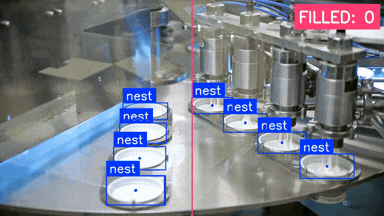

# Bakery Items counting using Yolo26

The **Bakery items counting** example demonstrates real-time object counting on a single input stream using the pre-trained yolo26n model on MemryX accelerators. This guide provides setup instructions, model details, and necessary code snippets to help you quickly get started.

<p align="center">
  
</p>

## Overview

| Property             | Details                                                                 |
|----------------------|-------------------------------------------------------------------------|
| **Model**            | [Yolo26n](https://docs.ultralytics.com/models/yolo26/)                                            |
| **Model Type**       | Object Detection                                                      |
| **Framework**        | [onnx](https://onnx.ai/)                                                   |
| **Model Source**     | [Download from Ultralytics GitHub or docs](https://docs.ultralytics.com/tasks/detect/) |
| **Pre-compiled DFP** | [Download here](https://developer.memryx.com/model_explorer/2p2/yolo26n-cone.zip)       |
| **Sample video for testing**      | [Cones moving in production line](https://app.envato.com/stock-video/bf8979cc-b598-4ef7-9d0d-c6a5b147f8fe) |
| **Model Resolution**            | 640x640                                                   |
| **Output**           | Bounding box coordinates with object probabilities |
| **OS**           | Linux |
| **License**          | [AGPL](LICENSE.md)                                      |

## Requirements

Before running the application, ensure that Python and OpenCV are installed, especially for the Python implementation. You can install OpenCV using the following command:

```bash
# For application
pip install opencv-python==4.11.0.86

pip install supervision

# For exporting source model to onnx
pip install pyyaml==6.0.2
pip install pandas==2.3.1
```
## Running the Application

### Step 1: Download Pre-compiled DFP

To download and unzip the precompiled DFPs, use the following commands:
```bash
wget https://developer.memryx.com/model_explorer/2p2/yolo26n-cone.zip
mkdir -p models
unzip yolo26n-cone -d models
```

<details> 
<summary> (Optional) Download and compile the model yourself </summary>
If you prefer, you can download and compile the model rather than using the precompiled model. 

Download the pretrained yolo26n.pt file from the Ultralytics documentation using the link below:

```bash
wget https://developer.memryx.com/model_explorer/2p2/yolo26n-cone.pt
```

You can use the following code to export the model to ONNX format:

```bash
from ultralytics import YOLO

# Load the model
model = YOLO("yolo26n-cone.pt")  # load the downloaded model

# Export the model
model.export(format="onnx")
```
This script will generate a yolo26n.onnx file.

You can now use the MemryX Neural Compiler to compile the model and generate the DFP file required by the accelerator:

```bash
mx_nc -m yolo26n-cone.onnx -v --autocrop
```
The compiler will generate the DFP and a post-processing file which can be passed as inputs to the application.

</details>

### Step 2: Run the Script/Program

With the compiled model, you can now run real-time inference. Below are the examples of how to do this using Pythonz.

#### Python

To run the Python example for object counting with yolo26n using MX3, simply execute the following command:

```bash
# ensure a camera device is connected as default video input is a cam
cd src/python/
python yolo26_bakery_products_counting.py 
```
You can specify the model path and DFP (Compiled Model) path with the following options:

* `-m` or `--postmodel`: Path to the model file (default is models/YOLO26_nano_640_640_3_onnx_post.onnx)
* `-d` or `--dfp`: Path to the compiled DFP file (default is models/YOLO26_nano_640_640_3_onnx.dfp)

You can specify the input video path with the following option:

* `--video_path` : Path to video file as inputs (default is /dev/video0, camera connected to the system)

For example, to run with a specific video, post-processing model and DFP file, use:

```bash
python yolo26_bakery_products_counting.py -m <postmodel_path> -d <dfp_path> --video_path /dev/video0
```

If no arguments are provided, the script will use the default post-processing model and DFP paths.

## Tutorial

A more detailed tutorial with complete code explanations is available on the [MemryX Developer Hub](https://developer.memryx.com). You can find it [here](https://developer.memryx.com/tutorials/realtime_inf/realtime_od.html)

## Third-Party Licenses

This project uses third-party software, models, and libraries. Below are the details of the licenses for these dependencies:

- **Model**:  [Yolo26n from Ultralytics GitHub](https://docs.ultralytics.com/models/yolo26/) 🔗 
  - License: [AGPLv3](https://github.com/ultralytics/ultralytics/blob/main/LICENSE) 🔗

- **Code and Pre/Post-Processing**: Some code components, including pre/post-processing, were sourced from their [GitHub](https://github.com/ultralytics/ultralytics)
  - License: [AGPLv3](https://github.com/ultralytics/ultralytics/blob/main/LICENSE) 🔗

- **Preview Video**: ["Ice Cream Production Line at the Food Factory" on Envato](https://app.envato.com/stock-video/bf8979cc-b598-4ef7-9d0d-c6a5b147f8fe)  
  - License: [Envato License](https://help.elements.envato.com/hc/en-us/articles/360000628966-Envato-Elements-License)

## Summary

This guide offers a quick and easy way to run single stream object counting using the Yolo26n model on MemryX accelerators. Download the full code and the pre-compiled DFP file to get started immediately.
