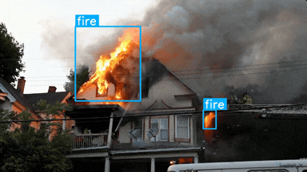

# Fire detection Using Yolov8s model

The **Fire Detection** example showcases real-time detection of fire at home, forecast using a custom-trained YOLOv8 small model running on MemryX accelerators. The system also tracks the detected fire for stable detection results.

This guide walks you through the setup process, explains the model used, and provides the required code snippets to help you get up and running quickly.

<p align="center">
  
</p>

## Overview

| Property             | Details                                                                 |
|----------------------|-------------------------------------------------------------------------|
| **Model**            | [Yolov8s](https://docs.ultralytics.com/models/yolov8/)                                            |
| **Model Type**       | Object Detection                                                        |
| **Framework**        | [ONNX](https://onnx.ai/)                                                   |
| **Model Source**     | [Download from Ultralytics GitHub or docs](https://docs.ultralytics.com/models/yolov8/) |
| **Pre-compiled DFP** | [Download here](https://developer.memryx.com/model_explorer/2p0/fire_small_640_640_3_onnx.zip)                                          |
| **Model Resolution** | 640x640                                                       |
| **Output**           | Object bounding boxes |
| **OS**               | Linux |
| **License**          | [AGPL](LICENSE.md)                                       |

## Requirements

Before running the application, ensure that Python, OpenCV, and the required packages are installed. You can install OpenCV and the Ultralytics package (for YOLO models) using the following commands:

```bash
pip install 'opencv-python~=4.11.0' 'ultralytics~=8.3.161' 'supervision~=0.27.0'
```

## Running the Application (Linux)

### Step 1: Download Pre-compiled DFP

To download and unzip the precompiled DFPs, use the following commands:
```bash
wget https://developer.memryx.com/model_explorer/2p0/fire_small_640_640_3_onnx.zip
mkdir -p models
unzip fire_small_640_640_3_onnx.zip -d models
```

<details> 
<summary> (Optional) Download and compile the model yourself </summary>
If you prefer, you can download and compile the model rather than using the precompiled model. Download the pre-trained YOLOv8s model and export it to ONNX:

You can use the following code to download the pre-trained yolov8s.pt model and export it to ONNX format:

```bash
from ultralytics import YOLO

# Download fire.pt (YOLOv8 trained model on fire dataset)
wget https://developer.memryx.com/model_explorer/2p0/fire.zip
unzip fire.zip

# Load a model
model = YOLO("fire.pt")

# Export the model
model.export(format="onnx")
```

You can now use the MemryX Neural Compiler to compile the model and generate the DFP file required by the accelerator:

```bash
mx_nc -v -m fire.onnx --autocrop -c 4 --dfp_fname fire_small_640_640_3_onnx
```

Output:
The MemryX compiler will generate two files:

* `fire_small_640_640_3_onnx.dfp`: The DFP file for the main section of the model.
* `fire_small_640_640_3-post.onnx`: The ONNX file for the cropped post-processing section of the model.

Additional Notes:
* `-v`: Enables verbose output, useful for tracking the compilation process.
* `--autocrop`: This option ensures that any unnecessary parts of the ONNX model (such as pre/post-processing not required by the chip) are cropped out.

</details>

### Step 2: Run the Script/Program

With the compiled model, you can now run real-time inference. Below are the examples of how to do this using Python.

#### Python

To run the Python example for real-time fire detection using MX3, simply navigate to `src/python/` and run the script.

```bash
cd src/python/
python3 run_fire_detection_tracking.py (--cam | --video VIDEO)
```

Where you either use:

* `--cam`: Use the camera as input source (will use opencv camera #0).
* `--video VIDEO`: Use a video file as input source.

There are additional optional arguments you can use to customize the behavior of the program:

* `--save`,`-s`: Enable saving output to file. Output will be ./results.mp4
* `--no_show`: Disable displaying output window. Useful for video file in -> video file out.
* `--dfp DFP`,`-d DFP`: Specify the path to the compiled DFP file. Default is '../../models/YOLO_v8_small_640_640_3_onnx.dfp'.
* `--post_model POST_MODEL`,`-post POST_MODEL`: Specify the path to the post model. Default is '../../models/YOLO_v8_small_640_640_3_onnx_post.onnx'.


## Third-Party Licenses

This project uses third-party software, models, and libraries. Below are the details of the licenses for these dependencies:

- **Model**: [yolov8s from Ultralytics GitHub](https://docs.ultralytics.com/models/yolov8/) 🔗 
  - [AGPLv3](https://github.com/ultralytics/ultralytics/blob/main/LICENSE) 🔗

- **Code and Pre/Post-Processing**: Some code components, including pre/post-processing, were sourced from their [GitHub](https://github.com/ultralytics/ultralytics)  
  - [AGPLv3](https://github.com/ultralytics/ultralytics/blob/main/LICENSE) 🔗

## Summary

This guide offers a quick and easy way to run fire detection using the yolov8s model on MemryX accelerators. You can use the Python implementation to perform real-time inference. Download the full code and the pre-compiled DFP file to get started immediately.
