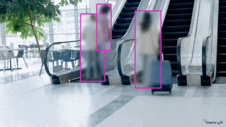

# Object blurring Using Yolov8s model

The **Object Blurring** example demonstrates real-time privacy protection of individual in public places using the pre-trained yolov8 small model on MemryX accelerators. This guide provides setup instructions, model details, and necessary code snippets to help you quickly get started.

<p align="center">
  
</p>

## Overview

| Property             | Details                                                                 |
|----------------------|-------------------------------------------------------------------------|
| **Model**            | [Yolov8s](https://docs.ultralytics.com/models/yolov8/)                                            |
| **Model Type**       | Object Detection                                                        |
| **Framework**        | [ONNX](https://onnx.ai/)                                                   |
| **Model Source**     | [Download from Ultralytics GitHub or docs](https://docs.ultralytics.com/models/yolov8/) |
| **Pre-compiled DFP** | [Download here](https://developer.memryx.com/model_explorer/2p0/YOLO_v8_small_640_640_3_onnx.zip)                                          |
| **Model Resolution** | 640x640                                                       |
| **Output**           | Object bounding boxes |
| **OS**               | Linux |
| **License**          | [AGPL](LICENSE.md)                                       |

## Requirements

Before running the application, ensure that Python, OpenCV, and the required packages are installed. You can install OpenCV and the Ultralytics package (for YOLO models) using the following commands:

```bash
pip install opencv-python==4.11.0.86
```

```bash
pip install ultralytics==8.3.161
```


## Running the Application (Linux)

### Step 1: Download Pre-compiled DFP

To download and unzip the precompiled DFPs, use the following commands:
```bash
wget https://developer.memryx.com/model_explorer/2p0/YOLO_v8_small_640_640_3_onnx.zip
mkdir -p models
unzip YOLO_v8_small_640_640_3_onnx.zip -d models
```

<details> 
<summary> (Optional) Download and compile the model yourself </summary>
If you prefer, you can download and compile the model rather than using the precompiled model. Download the pre-trained YOLOv8s model and export it to ONNX:

You can use the following code to download the pre-trained yolov8s.pt model and export it to ONNX format:

```bash
from ultralytics import YOLO

# Load a model
model = YOLO("yolov8s.pt")  # load an official model

# Export the model
model.export(format="onnx")
```

You can now use the MemryX Neural Compiler to compile the model and generate the DFP file required by the accelerator:

```bash
mx_nc -v -m yolov8s.onnx --autocrop -c 4 --dfp_fname YOLO_v8_small_640_640_3_onnx
```

Output:
The MemryX compiler will generate two files:

* `yolov8s.dfp`: The DFP file for the main section of the model.
* `yolov8s-post.onnx`: The ONNX file for the cropped post-processing section of the model.

Additional Notes:
* `-v`: Enables verbose output, useful for tracking the compilation process.
* `--autocrop`: This option ensures that any unnecessary parts of the ONNX model (such as pre/post-processing not required by the chip) are cropped out.

</details>

### Step-2: Sample Video

You can download the sample video footage for testing from the [link](TODO).


### Step 3: Run the Script/Program

With the compiled model, you can now run real-time inference. Below are the examples of how to do this using Python and C++.

#### Python

To run the Python example for real-time Object blurring using MX3, follow these steps:

Simply execute the following command:

```bash
cd src/python/
python run_object_blurring.py
```
Command-line Options:
You can specify the model path and DFP (Compiled Model) path using the following options:

* `-d` or `--dfp`:  Path to the compiled DFP file (default is models/YOLO_v8_small_640_640_3_onnx.dfp)
* `-post` or `--post_model`: Path to the post-processing ONNX file generated after compilation (default is models/YOLO_v8_small_640_640_3_onnx_post.onnx)

Example:
To run with a specific model and DFP file, use:

```bash
python run_object_blurring.py -d <dfp_path> -post <post_processing_onnx_path>
```

If no arguments are provided, the script will use the default paths for the model and DFP.


## Third-Party Licenses

This project uses third-party software, models, and libraries. Below are the details of the licenses for these dependencies:

- **Model**: [yolov8s from Ultralytics GitHub](https://docs.ultralytics.com/models/yolov8/) 🔗 
  - [AGPLv3](https://github.com/ultralytics/ultralytics/blob/main/LICENSE) 🔗

- **Code and Pre/Post-Processing**: Some code components, including pre/post-processing, were sourced from their [GitHub](https://github.com/ultralytics/ultralytics)  
  - [AGPLv3](https://github.com/ultralytics/ultralytics/blob/main/LICENSE) 🔗

## Summary

This guide offers a quick and easy way to run object blurring using the yolov8s model on MemryX accelerators. You can use the Python  implementation to perform real-time inference. Download the full code and the pre-compiled DFP file to get started immediately.
