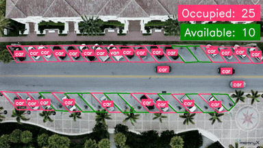

# Parking Management Using Yolov8s model

The **Parking Management** example showcases real-time parking monitoring from a top-down view using the YOLOv8 small model trained on the VisDrone dataset and accelerated with MemryX hardware.

The system detects vehicles, tracks them across frames, and analyzes their positions. If a vehicle is within a defined parking region, it is counted as occupied; otherwise, the spot is marked as available.

This guide includes setup instructions, model details, and essential code snippets to help you get started quickly.


<p align="center">
  
</p>

## Overview

| Property             | Details                                                                 |
|----------------------|-------------------------------------------------------------------------|
| **Model**            | [Yolov8s](https://docs.ultralytics.com/models/yolov8/)                                            |
| **Model Type**       | Object Detection                                                        |
| **Framework**        | [ONNX](https://onnx.ai/)                                                   |
| **Model Source**     | [Download from Ultralytics GitHub or docs](https://docs.ultralytics.com/models/yolov8/) |
| **Pre-compiled DFP** | [Download here](https://developer.memryx.com/example_files/2p0/visdrone_small_640_640_3_onnx.zip)                                          |
| **Model Resolution** | 640x640                                                       |
| **Output**           | Object bounding boxes |
| **OS**               | Linux |
| **License**          | [AGPL](LICENSE.md)                                       |

## Requirements

Before running the application, ensure that Python, OpenCV, and the required packages are installed. You can install OpenCV and the Ultralytics package (for YOLO models) using the following commands:

```bash
pip install opencv-python==4.11.0.86 ultralytics==8.3.161 supervision==0.27.0
```

## Running the Application (Linux)

### Step 1: Download Pre-compiled DFP

To download and unzip the precompiled DFPs, use the following commands:
```bash
wget https://developer.memryx.com/example_files/2p0/visdrone_small_640_640_3_onnx.zip
mkdir -p models
unzip visdrone_small_640_640_3_onnx.zip -d models
```

<details> 
<summary> (Optional) Download and compile the model yourself </summary>
If you prefer, you can download and compile the model rather than using the precompiled model.

Download the visdrone pretrained YOLOv8s model using the command mentioned below.

```bash
# Download visdrone-yolov8s.pt (YOLOv8 trained model on visdrone dataset)
wget https://developer.memryx.com/example_files/2p0/visdrone-yolov8s.zip
unzip visdrone-yolov8s.zip
```

You can use the following code to export it to ONNX format:

```bash
from ultralytics import YOLO

# Load a model
model = YOLO("visdrone-yolov8s.pt")  # load an official model

# Export the model
model.export(format="onnx")
```

You can now use the MemryX Neural Compiler to compile the model and generate the DFP file required by the accelerator:

```bash
mx_nc -v -m visdrone-yolov8s.onnx --autocrop -c 4 --dfp_fname visdrone_small_640_640_3_onnx
```

Output:
The MemryX compiler will generate two files:

* `visdrone_small_640_640_3_onnx.dfp`: The DFP file for the main section of the model.
* `visdrone-yolov8s-post.onnx`: The ONNX file for the cropped post-processing section of the model.

Additional Notes:
* `-v`: Enables verbose output, useful for tracking the compilation process.
* `--autocrop`: This option ensures that any unnecessary parts of the ONNX model (such as pre/post-processing not required by the chip) are cropped out.

</details>

### Step 2: Run the Script/Program

With the compiled model, you can now run real-time parking management. Below are the examples of how to do this using Python.


#### Download the sample video (optional)

The `assets/sample_regions.json` is built for [this sample video](https://developer.memryx.com/example_files/2p0/parking_sample.mp4). You can download it using the command below:

```bash
wget https://developer.memryx.com/example_files/2p0/parking_sample.mp4
mv parking_sample.mp4 assets/
```


#### Python

To run the Python example for real-time parking management using MX3, simply navigate to `src/python/` and run the script.

```bash
cd src/python/
python3 run_parking_management.py.py [--cam | --video VIDEO] [-j, --json REGIONS_JSON]
```

Where you either use:

* `--cam`: Use the camera as an input source (will use opencv camera #0).
* `--video VIDEO`: Use a video file as an input source. For example, `../../assets/parking_sample.mp4`


And

* `-j REGIONS_JSON`, `--json REGIONS_JSON`: Specify the parking regions json file. For example `../../assets/sample_regions.json`


There are additional optional arguments you can use to customize the behavior of the program:

```bash
python3 run_parking_management.py [--cam | --video VIDEO] [--dfp DFP] [--post_model POST_MODEL] [--save] [--no_show] [-j REGIONS_JSON]
```

Where the optional arguments are:

* `--save`,`-s`: Enable saving output to file. Output will be ./results.mp4
* `--no_show`: Disable displaying output window. Useful when working with video files.
* `--dfp DFP`,`-d DFP`: Specify the path to the compiled DFP file.
* `--post_model POST_MODEL`,`-post POST_MODEL`: Specify the path to the post model.

## How to Generate a Parking Regions JSON File

You can create the parking regions JSON file using the Python code below.

**Note:** First, save a single frame from your parking lot video stream. Then, use the code below to annotate the parking areas interactively.

For more details about the workflow, check the documentation [here](https://docs.ultralytics.com/guides/parking-management/#parking-management-system-code-workflow).

```python
from ultralytics import solutions

solutions.ParkingPtsSelection()
```

## Third-Party Licenses

This project uses third-party software, models, and libraries. Below are the details of the licenses for these dependencies:

- **Model**: [yolov8s from Ultralytics GitHub](https://docs.ultralytics.com/models/yolov8/) 🔗 
  - [AGPLv3](https://github.com/ultralytics/ultralytics/blob/main/LICENSE) 🔗

- **Code and Pre/Post-Processing**: Some code components, including pre/post-processing, were sourced from their [GitHub](https://github.com/ultralytics/ultralytics)  
  - [AGPLv3](https://github.com/ultralytics/ultralytics/blob/main/LICENSE) 🔗

## Summary

This guide offers a quick and easy way to run object blurring using the yolov8s model on MemryX accelerators. You can use the Python implementation to perform real-time inference. Download the full code and the pre-compiled DFP file to get started immediately.
